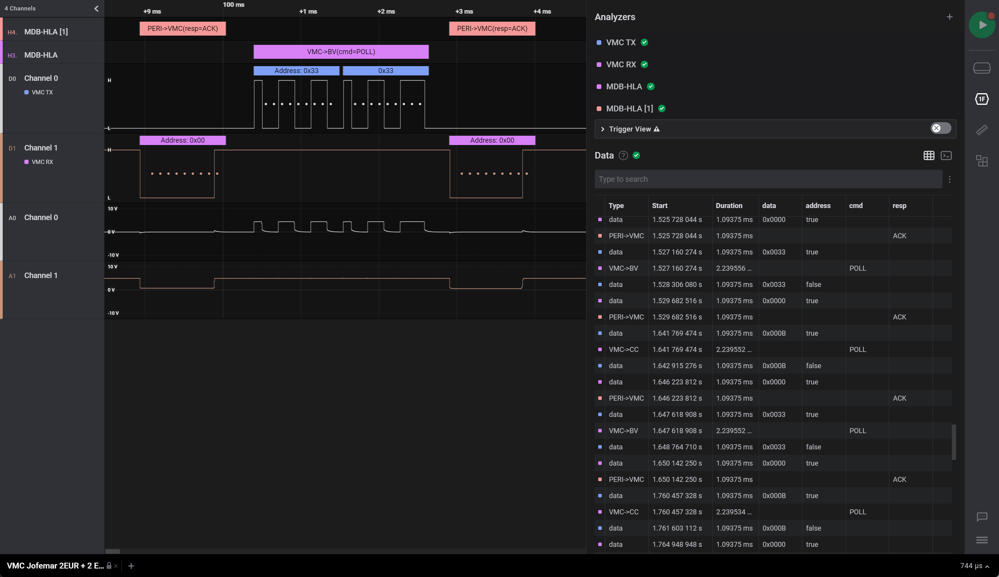

# MDB-HLA
MDB-HLA - Multi-Drop-Bus High-Level Analyzer for Saleae Logic 2.

## Features

 * Command validation
   * Mode bit
   * Checksum
 * Responses (ACK, NAK, RET)
 * VMC to peripheral
 * Peripheral to VMC
 * Decodes several Coin Changer and Bill Validator commands

Coin values are hard-coded (0.01 €, 0.02 €, 0.05 €, 0.10 €, 0.20 €, 0.50 €, 1.00 €, 2.00 €, 0...)

## License

MDB-HLA is licensed under [Apache License, Version 2.0](LICENSE).
